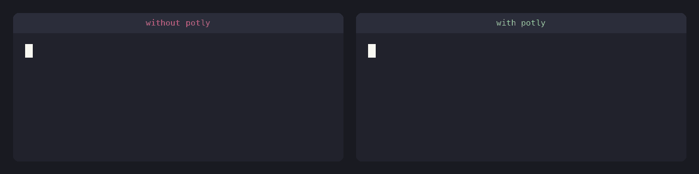

# potly

<p align="center">
  
</p>

potly fills everyday potholes in multi-agent, multi-machine workflows: URLs too long for the terminal, links stranded between devices, files too big to share. One binary, one command: it serves locally and publishes a public HTTPS URL, with no deploy step.

<p align="center">
  
</p>

> **What is Portal?** A safe, free, open-source self-hosting tunnel: [github.com/gosuda/portal-tunnel](https://github.com/gosuda/portal-tunnel).

## Potholes it fills

Every feature removes one friction you have been shrugging off:

- **Short links.** A long URL wraps across a narrow terminal or chat bubble, and whoever receives it has to reassemble it before it works. `GET /shorten` returns a short link as plain text.
- **A public URL with no deploy step.** Self-hosting normally means a server, a domain, and TLS certs. `-portal` prints a live HTTPS URL the moment the binary starts.
- **QR codes.** A link on your desktop is a retype away from your phone. `GET /qr` draws the code straight in your terminal; a browser gets a clean page instead.
- **One-time links.** A link pasted into chat lives in history forever, and every preview bot clicks it first. Add `&once=1` and it opens exactly once, behind a confirm page.
- **One-time secrets.** A password pasted into chat stays pasted. `POST /s` mints a link that burns after one read.

## How to use

### 1. Use it from an agent

Prompt your agent, e.g.:

```text
Look at https://github.com/gosuda/potly, deploy it, and send URLs as short links.
```

Or skip the deploy and use the live instance:

```sh
curl 'https://potly.gosunuts.xyz/shorten?url=https://github.com/gosuda/potly'
# https://potly.gosunuts.xyz/C8EnNw
```

### 2. Use it from the marketplace

Install the Claude Code plugin:

```
/plugin marketplace add gosuda/potly
/plugin install potly@potly
```

### 3. Run it yourself

Requires [Go](https://go.dev) 1.27 or newer.

```sh
git clone https://github.com/gosuda/potly
cd potly
go build -o potly .
./potly -portal     # public URLs appear on stderr; Ctrl-C tears the tunnel down
```

Portal mode is the default way to run: it picks several relays automatically, so you get one public URL per relay. For local-only use, drop the flag: `./potly` serves `http://localhost:8000`.

`-name` sets your subdomain, and `-relays` pins a specific Portal domain when you want one:

```sh
./potly -portal -name myapp -relays https://gosunuts.xyz    # https://myapp.gosunuts.xyz
```

No Go toolchain? Run the published image instead: `docker run -p 8000:8000 -v potly:/data ghcr.io/gosuda/potly -portal`.

## What's next

Daily dogfooding with agents drives the roadmap. Public file sharing that expires is next; every pothole found in real use becomes the next tool. No vendor lock-in, and everything stays under your control.

## License

[MIT](LICENSE).
